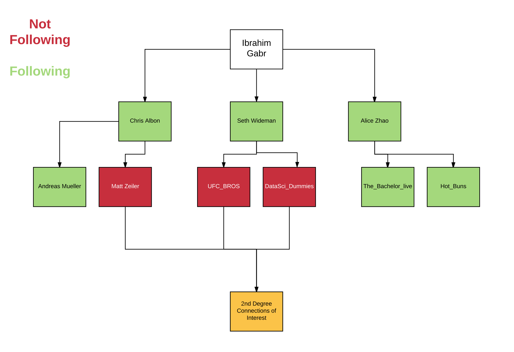

# Content Based Twitter Recommendation Engine

The focus of this project was Unsupervised Learning (K-Means Clustering) and Natural Language Processing.

**NLP Tools:**

- [spaCy](https://spacy.io/) - This library is far superior to NLTK. In fact, I think it makes NLTK look like a **toaster oven!** I utilised spaCy for tokenization and lemmatization! It is exceptionally fast (library is written in C) and produces fantastic results! 

- [NLTK](http://www.nltk.org/) - This is the traditional go to library for NLP. NLTK is also used almost exclusively in academic contexts. Let me stress, this does **NOT** mean that NLTK is the best NLP libary out there. [Here](https://automatedinsights.com/blog/the-python-nlp-ccosystem-a-short-and-very-opinionated-guide) is a good article on NLTK vs. spaCy.

- [TF-IDF Vectorizer](http://scikit-learn.org/stable/modules/generated/sklearn.feature_extraction.text.TfidfVectorizer.html) - This is an excellent vectorizor to use in tandem with K-Means clustering. TF-IDF is often more approriate than a regular count vectorizor. TF-IDF analysis represents a core component of this project!

- [Gensim](https://radimrehurek.com/gensim/) - A fantastic library to utilise for Latent Dirichlet Allocation - you can learn more about this [here](http://blog.echen.me/2011/08/22/introduction-to-latent-dirichlet-allocation/). I am especially fond of [LDAMulticore](https://rare-technologies.com/multicore-lda-in-python-from-over-night-to-over-lunch/). LDA is a core component of this project!

**Clustering Tools:**

- [K-Means Clustering](http://scikit-learn.org/stable/modules/generated/sklearn.cluster.KMeans.html) - The most used unsupervised ML algorithm for clustering!

**Infrastructure Tools:**

- [AWS EC2](https://aws.amazon.com/ec2/) - Ran all my analysis and models on the cloud. I wrote a wrapper around AWS EC2 - [`ec2.py`](https://github.com/igabr/Metis_Projects_Chicago_2017/blob/master/ec2.py). This wrapper will allow you to interact with EC2 via the command line.

- [AWS S3](https://aws.amazon.com/s3/) - For notebook and data transportation and storage. I wrote a wrapper around AWS S3 - [`s3.py`](https://github.com/igabr/Metis_Projects_Chicago_2017/blob/master/s3_script.py)

- [MongoDB](https://www.mongodb.com/) - For database storeage/access on an EC2 instance. I wrote my own custom wrapper around [PyMongo](https://api.mongodb.com/python/current/) - [`mongo.py`](Phases/Phase_1/mongo.py)

- [Tweepy](http://www.tweepy.org/) - Twepy is a great Python wrapper around the Twitter API. Again, I wrote my own wrapper around Tweepy! - [`tweepy_wrapper.py`](Phases/Phase_1/tweepy_wrapper.py)

- [`helper_functions.py`](Phases/Phase_1/helper_functions.py) - a selection of common functions I use across projects.

# Project Motivation

The central goal of this project was to create a Twitter Follower Recommendation System based upon the **contents** of the tweets of a particuar user. Specifically, 2nd degree connection users. In this way, we can create curated "you should follow X" suggestions. The hope is that this tool can be used to enhance user experience and discover new users!

### What is a 2nd degree connection user?

In the above diagram, green squares represent those users that I am currently following.

I define 2nd degree connection users, as those users, whom I am **NOT** following, but whom users **I FOLLOW** - **FOLLOW**.

It is on these users (red squares) tweets that I perform NLP on in order to analyze the content of their tweets. By content, I mean that via NLP, I wish to distill the 'essence' of what a particular user tweets about (for twitter rate limiting purposes, this is limitied to the most recent 200 tweets).

Now, there might be a variety of 'topics' that reside in the 'essence' of what a user tweets about. E.g. Data Science, Politics and Fast Food.

Through the techniques of LDA and K-Means combined with TF-IDF, I am able to find the most salient **words** *within* each topic. In fact, the crux of my project was finding the **intersection** between the words produced by LDA and TF-IDF.

# Findings

- **Discovery of Idle Accounts/Bots:** For certain users the LDA and TF-IDF analysis produced no words/topics! When investigting these particular users manually, I found that these subset of users were those who didnt have many tweets (< 50), haven't tweets in several years (~2014) or had little to no variation in content of tweets (Bots).

	- This was a surprise finding and is an **actionable insight** for either researchers or twitter itself!

- **Captures Overall User Narrative:** When applying the above methods to my own tweets, I re-discovered topics that I used to tweet about! I found this to be an interesting insight as it helped highlight the evolution of my interests over time.

	- This is also an **actionable insight** for twitter in that it can be used in a similar vein to Facebook's "1 year ago today" throwback.

- **Distillation of core word/topics on a user basis:** By looking at the intersection of my LDA and TF-IDF results, I am able to obtain robust results with regards to what a particular user tweet's about. The outputted results are almost always spot on!

# Notebooks and Scripts

**NOTE:** Due to rate limits set by the Twitter API, I had to limit myself to 200 tweets per user, in addition to only collecting data for 5% of all total 2nd degree connections. As such, this project is can be viewed as a **proof of concept**. All code is written in a way that would allow for seamless integration with a [Twitter Firehose API](https://brightplanet.com/2013/06/twitter-firehose-vs-twitter-api-whats-the-difference-and-why-should-you-care/).

### Proof of Concept Overview

1. User enters handle: Obtain all tweets

2. Find disjoint 2nd degree connections

3. Obtain 200 tweets for each

4. Perform LDA + TF-IDF on User tweets and 2nd degree connections

5. Present user with topics/terms based on *intersection of LDA + TF-IDF*

6. Iterate through 2nd degree user database - find matches

7. Present potential handles for a given search topic (i.e. machine learning)

#### Limitations

- No Access to Firehose API - cannot be real-time.

- KMeans takes time - 8 core machine. Could be scaled up!

- Private Tweets.

- Empty Tweets

- Nonsensical tweets

- Re-tweets

My project is split up into 4 phases. I will detail each phase below. For phases 3 & 4, there is a notebook that walks through the code in bite sized chunks - these notebooks will serve as the basis for their accompanying `.py` scripts that are a more dynamic implementation.

### Phase 1

Phase 1 was all about becoming comfortable with Tweepy and MongoDB. I find that the best way for me to learn a new library is to write my *own* wrapper around the functionality of the library. This way, I discover the core functionality of a particular library in addition to creating functions that are easily digestable to **me**. Furthermore, creating wrappers means I can use these libraries again in the future with no need to open up documentation! Simple plug and play!

*Wrappers:*

- [`tweepy_wrapper.py`](Phases/Phase_1/tweepy_wrapper.py)

- [`mongo.py`](Phases/Phase_1/mongo.py)

- [`df_functions.py`](Phases/Phase_1/df_functions.py) - During phase 1, I had a rough idea about how I wanted to store my data for cleaning. I find data cleaning to be a breeze when using [Pandas](http://pandas.pydata.org/), as such, this python file contains functions that can clean data while being held in a dataframe. Specificaly, I knew that the cells in my pandas dataframe would contain lists, as such, the code walks through pandas dataframe cells and **maps** a variety of different cleaning operations on the entire list. THis is exceptionally fast due to the use of [`map`](http://www.python-course.eu/python3_lambda.php) and [`lambda`](https://www.programiz.com/python-programming/anonymous-function) functions.

- [`helper_functions.py`](Phases/Phase_1/helper_functions.py) - This is a script that contains useful helper functions that I use across all my projects.

### Phase 2

Phase 2 was all about obtaining the **handles** of 2nd degree connections **and then** extracting their 200 **most recent** tweets. For each tweet, I extracted the *cleaned* text, hashtags (if any), retweet count and favourite count. By cleaned, tweet, I mean that I removed url's and emjoi's in addition to lower the case of the text.

I placed all of this data in a dictionary of the form: `{handle: {"content": [], "hashtags": [], "retweet_count" : [], "favorite_count": []}}`.

The use of lists ensured correct ordering for all data of a particular user.

I then placed this *massive* dictionary into a NoSQL database called MonogDB. I made use of my [`mongo.py`](Phases/Phase_1/mongo.py) wrapper to do this seamlessly.

- [handles_not_followed.py](Phases/Phase_2/handles_not_followed.py) - this script simply collected the names of all 2nd degree connections.

- [handle_tweet_extraction.py](Phases/Phase_2/handle_tweet_extraction.py) - this script collected all data for a particular handle

### Phase 3

Phase 3 was about starting the LDA analysis. You can see the step by step process by looking at the [Phase 3 Notebook](Phases/Phase_3/Phase_3_Notebook.ipynb).

The step by step process in the notebook performs LDA analysis on my own tweets!

The Phase 3 notebook served as the development ground to create the following scripts that did the LDA analysis for each **user** in our 2nd degree connection list:

- [`lda.py`](Phases/Phase_3/lda.py) - this script contains code that is similar to that found in the Phase 3 Notebook, it is just mroe dynamic!

- [`run_lda.py`](Phases/Phase_3/run_lda.py) - I created this script solely to be able to execute `lda.py` via the command line on a [screen](https://www.ibrahimgabr.com/blog/2017/7/26/aws-jupyter-notebook-setup-screening) on AWS. This ensures that losing internet connection or closing my computer would not interfere with the running of the program.

- [`LDA_result_exploration.ipynb`](Phases/Phase_3/LDA_result_exploration.ipynb) - This notebook explores the results of the LDA phase and makes a few adjustments that are required for the next Phase!

### Phase 4

While Phase 3 would have been sufficient to create a recommender system based on content. I decided to also test out TF-IDF along with K-Means clustering in order to assess whether they would corroborate the LDA results. I was ecstatic to find that I had a **strong intersection** of results between the two models.

**NOTE:** Ideally, I wanted to create 20 clusters for each user. Each cluster would represent a topic. However, I cannot ensure that every second degree connection user has *at least* 200 tweets and this has implications for the dimensions of the TF-IDF matrix. As such, for those uses where it is **impossible** to calculate 20 clusters, I calculate as many clusters as there are topics - that is, the numbers of rows in the TF-IDF matrix.

- [Phase 4 Notebook](Phases/Phase_4/Phase_4_Notebook.ipynb)

- [kmeans.py](Phases/Phase_4/kmeans.py)

### Demo

I have created a simple demo script that you can run from your terminal by typing `python3 demo.py`.

**NOTE:** This is a **STATIC** exampled based on my twitter account. You will need some pickle files in order to make the demo work.

You can download the files here via AWS S3:

- https://tinyurl.com/yapxvsrm - 2nd degree user database

- https://tinyurl.com/y8so7kh7 - database containing LDA and TF-IDF analysis for my tweets.

- https://tinyurl.com/yaml9xhw - file containing names of all handles.

- [`demo.py`](Phases/Demo/demo.py) - this is the demo file

# Conclusion

- Create an elegant GUI with Flask in order to collect user inputs and display results. Ideally, it would output direct links of reccommended 2nd degree users.

- When collecting the entire tweet history for myself, I found that the LDA/TF-IDF did not do so well in picking up topics that were more recent in my 'twitter narrative'. As such, I would like to experiement with some sort of weighting mechanism that will allow LDA/TF-IDF to better highlight newer topics in my narrative.

-  Re-run the analysis with the entire twitter history of 2nd degree users! This would require access to the Firehose API.

# Contact

I really hope you enjoy this project! Feel free to contact me via email at: igabr@uchicago.edu or [@Gabr_Ibrahim](https://twitter.com/Gabr_Ibrahim)

