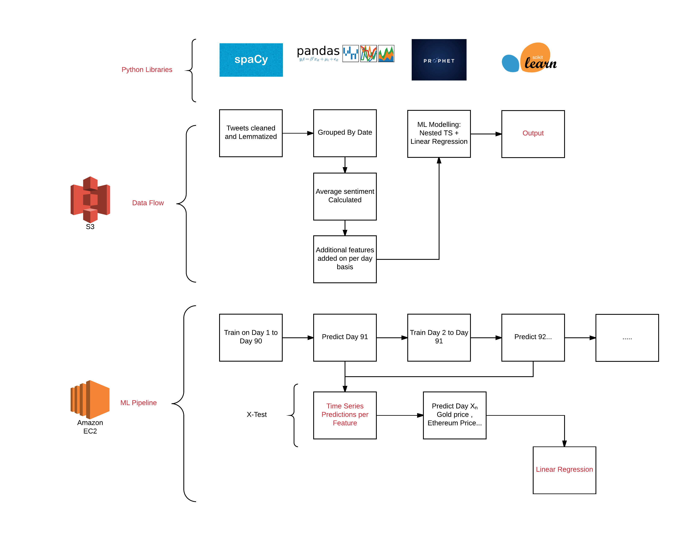

# Algorithmic Trading using Twitter Sentiment Analysis

The focus of this project was to utilize time series and linear regression methods to observe the effect of twitter sentiment on the price of Bitcoin.

I was able to show that there is a statistically significant relationship between positive sentiment and the price of Bitcoin the next day.

The greatest limitation in this project was collecting tweets. As such, I used data provided [here.](https://github.com/mluders/tweetwise)

This project was inspire by a Stanford student project that can be found [here.](http://cs229.stanford.edu/proj2015/029_report.pdf)

You can view the Google slides presentation of this project [here.](https://docs.google.com/presentation/d/1alMKiOTn8zAodrGEOdMpde11RfY8SCerPcAjBlS3rTI/edit?usp=sharing) The presentation covers the findings and the overall structure of the modeling process.

# Model

In this project I use a nested Time Series within a Linear Regression. I elucidate what this means in the [Final Notebook](Final_Notebook.ipynb)

# Notebooks and Scripts

The notebooks are quite contained detailed commentary! Enjoy!

- [Notebook 1](Notebook_1_DataFrame_Construction.ipynb)

- [Notebook 2](Notebook_2_Duplicate_removal_techniques.ipynb)

- [Notebook 3](Notebook_3_Exploration_Phase.ipynb)

- [Notebook 4](Notebook_4_DataFrame_Creation_Modeling.ipynb)

- [Notebook 5](Notebook_5_Feature_Additions.ipynb)

- [Prophet Baseline Model](Prophet_baseline_model.ipynb) - This notebook constructs a Bitcoin price prediction solely using the [Facebook Prophet Time Series Library.](https://facebookincubator.github.io/prophet/)

- [Prophet Baseline Script](prophet_baseline_btc.py) - This script contains code that runs the aforementioned prophet model.

- [Final Notebook](Final_Notebook.ipynb) - This notebook has an overview of all the model techniques I used to get my final results.

- [Nested Time Series + Linear Regression Script](regression_ts_model.py) - This is the script that run the main model of this entire project!

- [Helper Functions Script](helper_functions.py) - a python script that contains functions I use often!

- [Filters Script](filters.py) - a python script that was used to assist in the tweet clean process.

- [Bitcoin Info Script](btc_info_df.py) - a python script that selects the correct date range and formats the data correctly.

- [Plotly Script](plotly_functions.py) - a wrapper around the [plot.ly](https://plot.ly/) library.

- [Prophet Helper](prophet_helper.py) - this script is contains the code needed to run a Facebook Prophet prediction for an individual feature.

